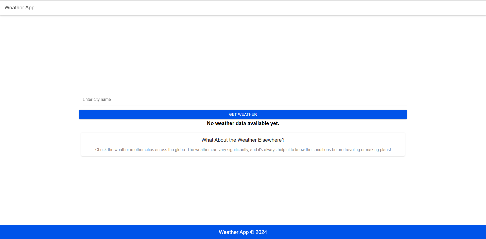

# Weather App
KARAN GILL
ABEL SAM MATHEW 
ARMANJOT SINGH
JEELKUMAR

LIVE LINK-
https://groupfinal.netlify.app/home
## Description

This Weather App allows users to fetch real-time weather data by entering a city name. It displays essential weather details such as temperature, humidity, wind speed, and conditions. The app utilizes the OpenWeatherMap API to gather weather data and is built using **Ionic Framework** with **Angular**. Bootstrap is also used to enhance the user interface with responsive design and modern styles.

## Features

- Enter a city name to fetch weather data.
- Displays temperature, weather condition, humidity, and wind speed.
- Loading spinner shows while the data is being fetched.
- Error handling if the city is not found or there’s a connection issue.
- Footer with copyright information.

## Technologies Used

- **Ionic Framework**: For building mobile-first web apps.
- **Angular**: Framework for building dynamic and single-page applications.
- **Bootstrap**: For responsive and modern styling.
- **OpenWeatherMap API**: For fetching weather data.

## Setup Instructions

### Prerequisites

- Node.js (version 14 or later)
- Ionic CLI (`npm install -g @ionic/cli`)

### Installation

1. Clone the repository:
   ```bash
   cd weather-app
   ```

2. Install dependencies:
   ```bash
   npm install
   ```

3. Install Bootstrap:
   ```bash
   npm install bootstrap
   ```

4. Include Bootstrap in your project:
   Open `angular.json` and add Bootstrap to the styles array:
   ```json
   "styles": [
     "src/styles.scss",
     "node_modules/bootstrap/dist/css/bootstrap.min.css"
   ]
   ```

5. Replace `src/app/home/home.page.ts` with your code for fetching weather data.

### Configuration

- **API Key**: Obtain a free API key from [OpenWeatherMap](https://openweathermap.org/api) and replace the `apiKey` variable in `home.page.ts`.

```typescript
const apiKey = 'your-api-key-here'; 
```

### Running the App

1. To run the app in the browser:
   ```bash
   ionic serve
   ```

### Testing the App

- Open your browser and navigate to `http://localhost:8100/`.
- Enter a city name in the input field and click the "Get Weather" button.
- The weather data for the specified city should appear.

## Screenshots

### Weather Display


## License

This project is licensed under the MIT License.

## Acknowledgments

- [OpenWeatherMap API](https://openweathermap.org/api) for providing the weather data.
- [Ionic Framework](https://ionicframework.com/) for building cross-platform mobile apps.
- [Bootstrap](https://getbootstrap.com/) for responsive styling.

